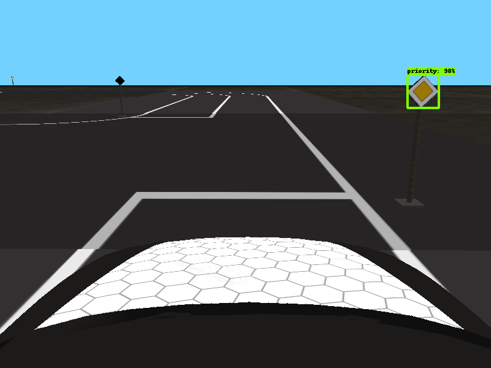

# Gym-Duckietown based simulation

[Duckietown](http://duckietown.org/) self-driving car simulator environments for OpenAI Gym.

<p align="center">
<br>
</p>


## Introduction

This simulator is fast, open, and incredibly customizable. It is a fully-functioning autonomous driving simulator that you can use to train and test your Machine Learning, Reinforcement Learning, Imitation Learning, or even classical robotics algorithms. 

## Installation

Requirements:
- Python 3.6+
- OpenAI gym
- NumPy
- Pyglet
- PyYAML
- cloudpickle
- pygeometry
- dataclasses (if using Python3.6)
- PyTorch or Tensorflow (to use the scripts in `learning/`)
- Keras

You can install all the dependencies except PyTorch with `pip3`:

```
git clone https://github.com/victor0198/Virtual_Track.git
cd gym-duckietown
pip3 install -e .
```

## Usage

### Testing

There is a simple UI application which allows you to control the simulation or real robot manually. The `manual_control.py` application will launch the Gym environment, display camera images and send actions (keyboard commands) back to the simulator or robot. You can specify which map file to load with the `--map-name` argument:

```
./manual_control.py --env-name Duckietown-udem1-v0 --map-name utm
```

There is also a script to run automated tests (`run_tests.py`) and a script to gather performance metrics (`benchmark.py`).

